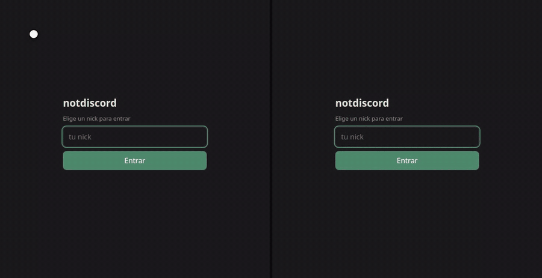
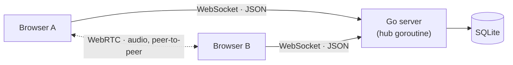

# notdiscord

A small Discord, built from scratch: real-time text channels plus per-channel
voice chat, in about 2,300 lines of Go and vanilla JavaScript. No web framework,
no frontend build step, no npm. The whole thing ships as **one 11 MB static
binary** with the web client embedded in it — `scp` it to a server and run it.

[](https://github.com/iaaaanb/notdiscord/actions/workflows/ci.yml)



*Two real clients, side by side — not a mockup. Text goes through the server;
the audio in the voice part goes directly between the two browsers. Recorded by
[a script](scripts/record-demo/) that fails if the voice never actually connects.*

> The UI and the code comments are in Spanish; this README is in English.

## What it does

- **Text channels** — create them on the fly, switch between them, last 50
  messages per channel persisted in SQLite and replayed on join.
- **Voice channels** — up to 6 people talking over WebRTC. The audio is
  peer-to-peer: it never touches the server.
- **Presence** — who is online, who is in which voice channel, and a speaking
  indicator driven by real-time RMS analysis of each stream.
- **Reconnection that actually works** — drop your Wi-Fi and you come back to
  the same nick, the same channel and your history, without anyone else seeing
  you leave and rejoin.
- **Runs as a service** — graceful shutdown, hardened systemd unit, Caddy for
  automatic TLS.

## Architecture



Text goes through the server. Audio does not — the server only relays the
WebRTC handshake and then gets out of the way.

The server is one goroutine. `Hub.Run` owns *all* mutable state (connected
clients, nicks, channels, voice membership) and everything reaches it over Go
channels, so there is not a single mutex in the codebase.

```
cmd/server/         flags, wiring, graceful shutdown
internal/protocol/  the JSON envelope and every message type
internal/chat/      the hub (state, broadcast, voice routing) and per-connection pumps
internal/store/     SQLite: channels and message history
web/                the client (HTML/CSS/JS), embedded with go:embed
deploy/             Caddyfile, systemd unit, deploy script
scripts/record-demo/  Playwright script that regenerates the GIF above
```

## Design notes

The parts that were actually interesting to get right:

**One owner for all state.** The classic Go chat pattern: instead of guarding
maps with mutexes, a single goroutine owns them and the rest of the program
talks to it through channels. Concurrency bugs stop being a class of bug you
have to think about. CI runs the tests under `-race` to keep it that way.

**Slow clients get dropped, not waited on.** A client with a full send buffer
is a client that would block the hub — and blocking the hub means freezing the
entire server for everyone. `broadcast` does a non-blocking send and evicts
whoever can't keep up.

**Reconnecting is an identity problem, not a retry problem.** Naive retry logic
fails on the interesting case: the server hasn't yet noticed your old TCP
connection is dead, so your nick looks taken — by you. Each session gets an
opaque token, and `set_nick` uses it to distinguish "same person coming back"
from "someone else trying to take this nick". On a successful reclaim the
server hands the nick to the new connection, closes the zombie, and
deliberately stays quiet: no join/leave messages, so a two-second Wi-Fi blip is
invisible to everyone else. Dead connections are found within ~40s by a
ping/pong keepalive, and the client reconnects with exponential backoff plus
jitter.

**Avoiding WebRTC glare without any state.** In a mesh, if both peers send an
offer simultaneously the two offers collide and someone has to back down. The
fix here is to make it impossible: of each pair, only the lexicographically
smaller nick offers. One string comparison replaces a negotiation protocol.

**The server is a switchboard, and only that.** `signal` payloads are relayed
opaquely — the server never parses SDP or ICE. It does check that both parties
are in the same voice channel, so the endpoint can't be used to spray packets
at users who aren't in the conversation.

**Pure-Go SQLite, on purpose.** `modernc.org/sqlite` is SQLite translated to
Go rather than a cgo binding, so `CGO_ENABLED=0 go build` produces a static
binary. That is what makes deployment a `scp` instead of installing a compiler
on the server.

**The 6-person cap is a feature.** In a full mesh every participant uploads
their audio N−1 times. Past a handful of people the correct answer is an SFU,
so the server refuses the 7th person with a clear error instead of letting the
call quietly turn to mush.

## Running it

Needs Go 1.25+. No other dependencies — no gcc, no node.

```bash
go run ./cmd/server                 # http://localhost:8080
go run ./cmd/server -addr :9000 -db /tmp/notdiscord.db
```

Open two browser tabs and pick a different nick in each. For voice, use
headphones if you're testing alone — and note that browsers only hand over a
microphone in a secure context, so voice works on `localhost` or over HTTPS,
never over plain HTTP to an IP.

```bash
go test -race ./...
```

Eight integration tests over a real `httptest` server and real WebSocket
connections, covering the things most likely to break: reclaiming a nick with a
valid session token, *failing* to reclaim without one, landing in `general`
when your saved channel is gone, voice membership across connect and
disconnect, signal routing and its same-channel check, voice surviving a text
channel switch, and the mesh capacity limit.

## Protocol

Every frame is `{"type": "...", "data": {...}}`.

| Client → server  | Server → client |
| ---------------- | --------------- |
| `set_nick`       | `nick_ok`, `error` |
| `send_message`   | `message`, `history` |
| `join_channel`   | `channel_joined` |
| `create_channel` | `channel_list` |
| `voice_join` / `voice_leave` | `voice_state` |
| `signal`         | `signal` |
|                  | `user_joined`, `user_left` |

## Deploying

[`DEPLOY.md`](DEPLOY.md) walks through it end to end: DNS, a hardened systemd
unit, Caddy for automatic TLS, and `deploy/deploy.sh` for the build-copy-restart
cycle. TLS isn't optional — without HTTPS the browser won't give you a
microphone.

## Limitations

Honest about what this is and isn't:

- **No accounts.** Anyone with the URL can take any free nick.
- **Session tokens live in memory**, so a server restart invalidates them.
  Nicks are lost on restart too, so nothing is left inconsistent.
- **Voice needs STUN and can fail behind symmetric NAT.** The real fix is a
  TURN server (coturn); the client says so explicitly when a peer connection
  fails, instead of leaving you guessing.
- **6 people per voice channel.** An SFU (Pion) is the natural next step, and
  it would eliminate the NAT problem too, since everyone would connect to the
  server's public IP instead of to each other.

## License

MIT — see [LICENSE](LICENSE).
